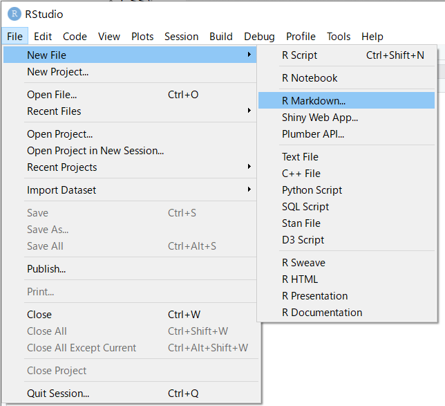
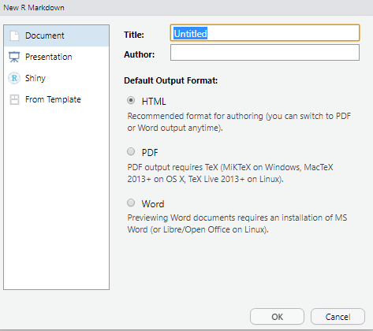
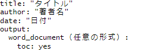
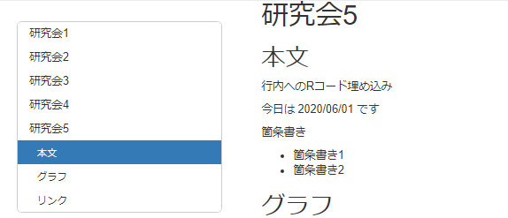
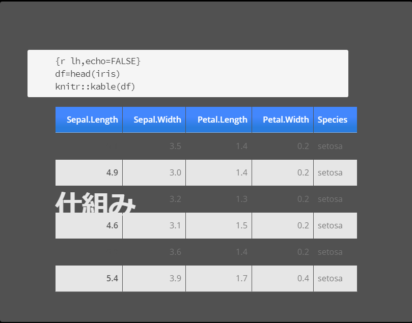

```{r setup, include=FALSE}
knitr::opts_chunk$set(echo = TRUE)
library(ggplot2)

```

## R Markdownのいいところ

### Rのコードを反映した文書やプレゼンテーションが作れる

### Rの分析結果をそのまま発表に使えて便利

### コード書き換えたらすぐ反映されて便利



## 仕組み

### 文書はマークダウン記法
1. #(見出し）>##（小見出し）＞### ＞####（文字のサイズ)
    - #空白　文字列
2. 空白や空行で改行や段落分けを行う
    - 行末に半角スペース2つ以上いれると改行
    - 上下に空行を挟むと、そこを段落ブロックとして認識
3. 強調（*や-ではさむ)
4. 箇条書き 
    - 番号なしの箇条書きの場合は-と空白をいれる
    - 番号付きの箇条書きの場合は1.と空白を入れる
    - スペース4つを入れると階層構造をつけることができる
5. markdown で表現できないことはHTMLタグ<span style="color:pink">色とか</span>

    
    
---


### Rのコードはチャンクといわれるとこに書く
Rチャンクの書き方→
```
 　　文章
 　　
 　　```
 　　{r 名前(かぶらないようにつける),echo=FALSE}
 　　（FALSEではコード自体が出力されない、TRUEではされる）
　　　Rのコード
 　　```
 　　
 　　文章
 　　

```
{}の部分を書かないとコードが文書にコードのまま乗る
（コードが読み込まれない）

---

<span style="color:red">プロット</span>
```{r pressure1, echo=TRUE}
plot(lh)
```


---

表

```{r iris2,echo=TRUE}
df=head(iris)
knitr::kable(df)
```

---

```{r iris3,echo=TRUE}
graph_data <- ggplot(diamonds, aes(y=carat,x=cut, fill=cut))+geom_boxplot()
plot(graph_data)
```

---


### YAMLによるメタデータ指定


新しいrmarkdownファイルをつくるときに出力を選べばrstudioが書いてくれる




----

### 様々な出力
先頭にYAMLフロントマターと呼ばれる「---」で囲まれた領域があり出力形式に関する設定を変えられる


凡例

　

tocを有効にすることで見出しの整理ができる

文書やスライド、配布資料　HTMLなど多様な形式で出力できる

----

toc_floatを有効するとサイドメニューができて見出しにアクセスしやすくなる


　

knitボタンをクリックするとrstudio上に文書が展開される

そこでopen in the browser するとをクリックするとブラウザ上に展開


----


スライドで出力して下ののように重なってしまうとき


　

改行―――改行で仕切る

---
ドルマーク2個でLatexの数式を挟むと数式をかける

ドルマーク1個でLatexの数式を挟むと数式を文中かける
$$\operatorname{PDF}_{normal}(x)=
\frac{1}{\sigma \sqrt{2 \pi}} \exp
\begin{bmatrix}
- \frac{1}{2}
\begin{pmatrix}
\frac{x - \mu}{\sigma}
\end{pmatrix}
^2
\end{bmatrix}　$$


### リンク


square bracket表示する文字square bracket　(url)で書ける

[google](https://www.google.co.jp/)


ライブラリの読み込み

rsetupのところで読み込む


